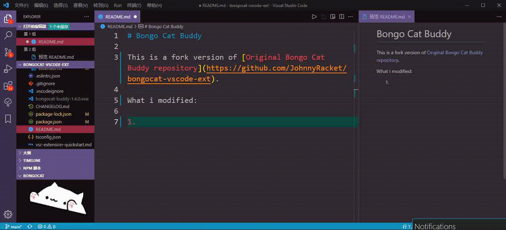

# Bongo Cat Buddy

This is a fork version of [Original Bongo Cat Buddy repository](https://github.com/JohnnyRacket/bongocat-vscode-ext).

What i modified:

1. Move to the explorer.
2. Change animations according to what u type.
3. Automatically load addon when startup vscode which is a bad idea but convenient.

# Result

